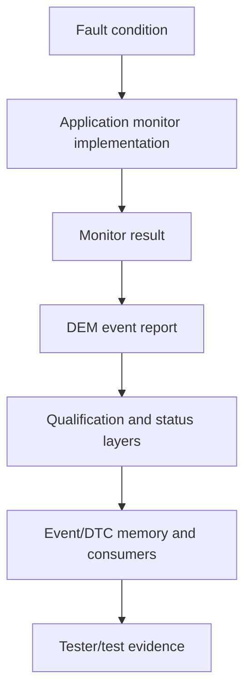

# Management ECU DEM — State and Evidence Model

Status: **Luna compile proposal; no project runtime state asserted**

This model keeps related diagnostic objects and observations typed. Authority tags resolve to exact tuples in the Reference Index.

## State chain



The arrows are evidence/processing handoffs, not identity equivalences. `[AUTOSAR-SEM-4EFF] [VECTOR-DEM-D922]`

## Typed state and artifact layers

| Layer | Owning concern | Input/evidence | Output/state | What it does not prove | Authority |
|---|---|---|---|---|---|
| Fault condition | physical or modeled condition | project stimulus or approved model fault | condition selected/active/triggered | monitor result or DEM event | `[MW-FAULT-2FB]` |
| Monitor implementation | Application design | project algorithm and preconditions | model/generated monitor behavior | DEM configuration or DTC identity | `[MW-MODEL-2FB] [MW-PROC-2FB]` |
| Monitor result | Application verification | executed monitor inputs | pass/fail/result signal | DEM event report or qualification state | `[MW-PROC-2FB] [MW-TEST-2FB]` |
| DEM event report | Application-to-DEM boundary | report API/interface contract | DiagnosticEvent/event processing input | DTC identity or tester response | `[AUTOSAR-SEM-4EFF] [VECTOR-DEM-D922]` |
| Debounce/qualification | DEM or monitor-owned route | report timing and selected policy | counter/time/FDC/qualified state | monitor status or DTC status | `[AUTOSAR-SEM-4EFF]` |
| Monitor status | DEM monitor-state evidence | processed report/qualification | monitor status and callback timing | event UDS/DTC status | `[AUTOSAR-SEM-4EFF] [AUTOSAR-FIM-938]` |
| Event UDS status | DEM event status semantics | event processing and cycle/condition state | event-level UDS status | DTC identity or memory entry | `[AUTOSAR-SEM-4EFF]` |
| DTC status | DEM/DTC processing | Event-to-DTC relation/combination | DTC or combined-DTC status | Event identity or memory bytes | `[AUTOSAR-SEM-4EFF] [AUTOSAR-OWN-938]` |
| DTC identity | diagnostic configuration | project Event/DTC inventory and mapping | DTC number/format/selection identity | status, entry or response contents | `[AUTOSAR-SEM-4EFF] [AUTOSAR-OWN-938]` |
| Event-memory entry | DEM fault-memory lifecycle | storage condition, trigger, capacity and policy | allocated/updated/removed entry | NvM block representation or DCM response | `[AUTOSAR-SEM-4EFF] [AUTOSAR-OWN-938]` |
| NvM representation | NvM persistence support | DEM reference and NvM block descriptor | request/storage/recovery state and persisted representation | DEM semantic correctness or DTC response | `[AUTOSAR-SEM-4EFF] [VECTOR-DEM-D922]` |
| DCM tester response | DCM service processing | tester request, DCM checks and DEM result | UDS response/transport result | internal DEM debounce, entry or NvM state | `[AUTOSAR-DCM-938] [VECTOR-DEM-D922]` |
| Test definition | test authoring | selected project description and criteria | DiVa/CANoe or Simulink test artifact | execution result or DEM state | `[VECTOR-DEM-D922] [MW-TEST-2FB]` |
| Execution | runtime/test engine | loaded package and stimulus | run trace and execution result | verdict/report unless evaluated | `[VECTOR-DEM-D922] [MW-TEST-2FB] [MW-MIL-SIL-2FB]` |
| Verdict | evaluation | result and criteria | pass/fail or assessment | coverage or internal DEM state | `[MW-TEST-2FB] [MW-COVERAGE-2FB]` |
| Coverage | structural evidence | configured objectives and execution data | coverage data/aggregation/report | semantic verdict or DEM state | `[MW-COVERAGE-2FB]` |
| Report | derived presentation | result/definition/coverage objects | result or specification report | underlying source state | `[MW-TEST-2FB] [MW-COVERAGE-2FB]` |

## Configuration and runtime boundary

The following sequence is a lifecycle, not a single artifact:

```text
static semantic/configuration decision
  -> generated configuration / BSW/RTE artifact
  -> Integration SUT representation and package
  -> CANoe loaded runtime
  -> tester-visible response
  -> result/verdict/report
```

`configuration != generated configuration != runtime state != tester response != test verdict/report`. `[VECTOR-DEM-D922]`

For the Management ECU virtual route, the canonical product-local path is:

```text
configured/generated DEM/RTE/BSW + Application
  -> vVIRTUALtarget Integration
  -> Integration SUT representation
  -> build/package
  -> CANoe load and diagnostic configuration
  -> bounded project stimulus
  -> tester-visible DTC observation
```

BSW Emulation is not a substitute for this route. `[VECTOR-DEM-D922]`

## Internal observability rule

CANoe can provide tester-facing DTC responses, traces, verdicts and reports at the reviewed product-local surface. Those observations are not direct proof of internal DEM debounce state, event-memory entry or NvM stored representation. A project-specific instrumentation bridge, generated symbol route or equivalent authorized internal observation is required for those states. When absent, record `RUNTIME_OBSERVABILITY_GAP` rather than inferring internal state. `[VECTOR-DEM-D922]`

## Semantic configuration decisions

The following decisions are independent:

1. DEM-internal debounce versus monitor-internal/predebounce;
2. operation-cycle identity and physical meaning;
3. enable condition versus storage condition;
4. monitor status, event UDS status, DTC status and callback timing;
5. Event-to-DTC relation versus event-combination mode;
6. event-memory representation/lifecycle;
7. event-related-data definition/capture/update;
8. DEM semantic state versus NvM descriptor/request state;
9. monitor pass versus aging versus AUTOSAR DEM indicator healing versus ClearDTC.

The AUTOSAR supplement closes these as semantic distinctions but does not create project values. `[AUTOSAR-SEM-4EFF]`

## Backward symptom navigation

| Observed symptom | First owning layer | Evidence to request | Do not conclude |
|---|---|---|---|
| No tester-visible DTC response | DCM/service or transport route, then DEM query result | DCM request/condition trace, DEM result, transport evidence | internal debounce or memory absence from response alone |
| Unexpected DTC status | DEM status and Event/DTC relation | report/qualification/status layers, relation/combination configuration | monitor algorithm fault or DTC identity error without typed evidence |
| Event appears not stored | DEM storage condition/memory lifecycle, then NvM support | storage eligibility, entry lifecycle, persistence reference, NvM request state | NvM block absence from a DCM response |
| Freeze-frame/extended data differs | DEM event-related-data definition/capture | data definition, trigger/update, source/provider, response trace | response bytes prove definition/content ownership |
| FiM permission differs | FiM consumer calculation | source monitor status, FID/EventID/mask relation, permission result | FiM owns DTC status or event memory |
| DiVa test fails | test definition/generation/import/execution/result layers | selected row, generated artifact, CANoe configuration, trace, result/report | test failure proves internal DEM state |
| Coverage is low while verdict passes | coverage result branch | objective configuration, achieved data, filter/justification state | verdict and coverage are synonyms |

The backward route is evidence triage, not an automatic causal diagnosis. Exact project configuration and artifacts are required for a conclusion. `[AUTOSAR-SEM-4EFF] [AUTOSAR-DCM-938] [AUTOSAR-FIM-938] [VECTOR-DEM-D922] [MW-COVERAGE-2FB]`

## Required non-collapse statements

```text
Event != DTC
DEM != DCM
DEM != FiM
DEM != NvM
enable condition != storage condition
operation cycle != ignition cycle by default
ClearDTC != monitor pass
ClearDTC != aging
ClearDTC != AUTOSAR DEM indicator healing
verdict != coverage
```

No Management ECU Event ID/name, DTC, mapping, algorithm, debounce value, cycle meaning, condition, memory setting, event-data content, NvM identity/layout/CRC, FiM relation, application symbol, network address, stimulus, expected transition, test vector, tolerance or acceptance criterion is asserted here.
